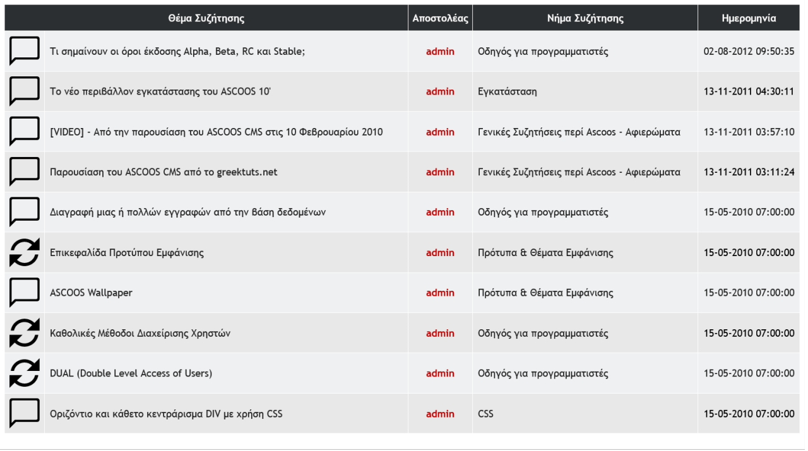
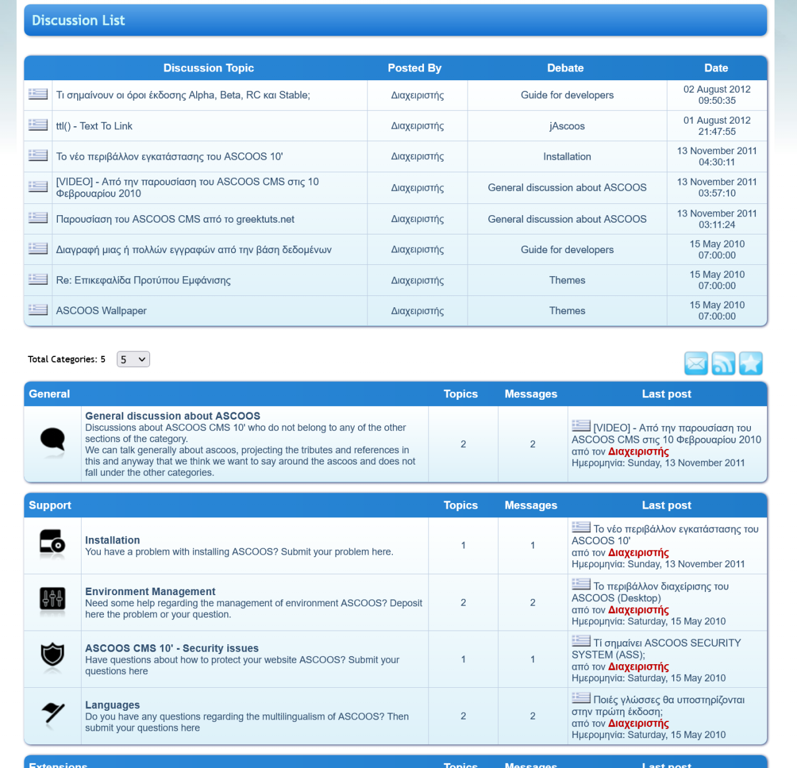
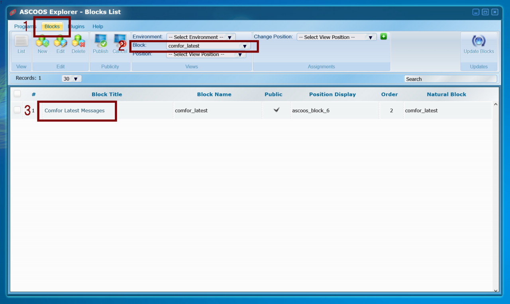
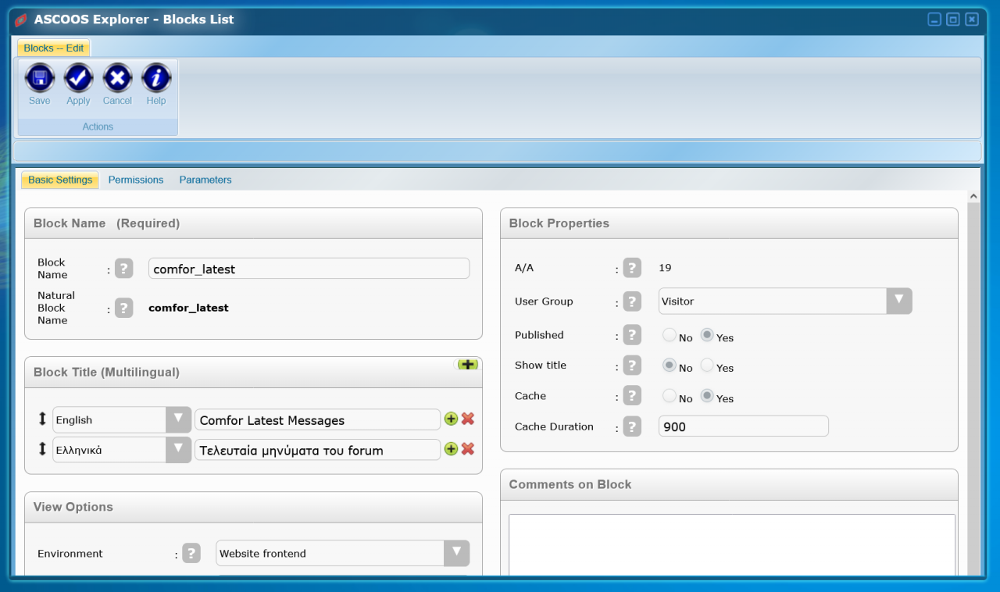

# Ascoos Cms Block | `comfor-latest`

## Description

This block displays a list of the latest messages from `Comfor` forum  on the website.

The contents can be displayed in the current or in all languages where texts are available.

In the image we see the appearance using the `gen24 theme`.

## What is Comfor
`Comfor` is a discussion program integrated into **Ascoos Cms** and enables discussions with multilingual messages.

Also, like all the programs in **Ascoos Cms**, it has the ability to:
- change appearance through themes.
- display in the user's current language.
- Up to "personalized" access rights.

And much more.

In the image below we see a view of the Comfor default theme.

***

## Management

The block is managed through the ASCOOS Explorer program

 

We can configure its contents from the parameters

***

 

## Documentation

You can find more information about the block on the documentation page of [Ascoos CMS - BLOCKS - Comfor Latest Message Documantation](help/tutorial.en.md)

 

## Feedback

Please send any feedback or suggestions to [@ascoos](https://twitter.com/ascoos) (Twitter) or [create an issue](https://github.com/ascoos/comfor-latest/issues) on GitHub.

  
 
## License

[ASCOOS General License (Free Use) - AGL-F](http://docs.ascoos.com/lics/ascoos/AGL-F.html)

 

***

 

## Download

- [ASCOOS CMS Block | Comfor Latest Messages from Original Download site](https://dl.ascoos.com/cms/ascoos/ext/blocks/comfor-latest/ascoos-block-comfor-latest.zip)

- [ASCOOS CMS Block | Comfor Latest Messages from Github](https://github.com/ascoos/comfor-latest/releases)